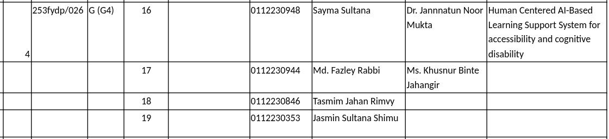

# Final Year Design Project (FYDP I) – Fall 2025

**Title:** Human Centered AI-Based Learning Support System for Accessibility and Cognitive Disability

**Course Teacher:** Dr. Hasan Sarwar (HS)

**Topic:** 	S/W & HCI

**Group Form Serial:** 253fydp/026

**Supervisor(s):** Dr. Jannnatun Noor Mukta & Ms. Khusnur Binte Jahangir

**Trimester:** Fall 2025

**Section:** G (G4)

## Team Members

| ID | Name |
| --- | --- |
| 0112230948 | Sayma Sultana |
| 0112230944 | Md. Fazley Rabbi |
| 0112230846 | Tasmim Jahan Rimvy |
| 0112230353 |  Jasmin Sultana Shimu |