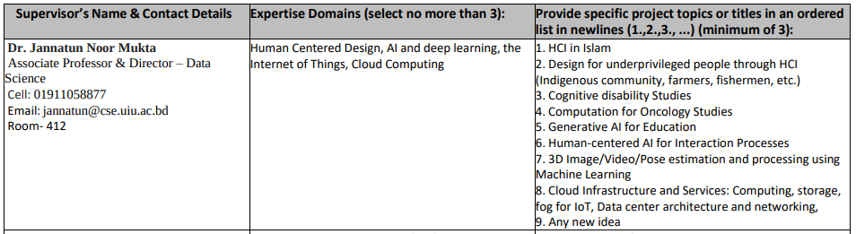
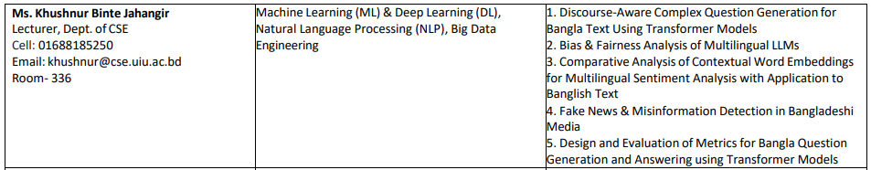

## 👩‍🔬 Supervisor 1: Dr. Jannatun Noor Mukta

**Designation:** Associate Professor & Director – Data Science

**Room:** 412

**Cell:** 01911058877

**Email:** jannatun@cse.uiu.ac.bd

**Portfolio:** [Link](https://sites.google.com/site/jannatun0abigzero/home)

**Google Scholar:** [Dr. Jannatun Noor Mukta – Google Scholar](https://scholar.google.com/citations?user=nUColk4AAAAJ&hl=en)

**ResearchGate:** [Dr. Jannatun Noor Mukta – ResearchGate](https://www.researchgate.net/profile/Jannatun-Noor)

**Research Topic:** [Show](https://docs.google.com/document/d/1ZhqbxgSuYyFj7eH5_HLYVo_5uNCS1r5S1E0DY_KcO3g/edit?tab=t.0)

**LinkedIn:** [Dr. Jannatun Noor Mukta – LinkedIn Profile](https://www.linkedin.com/in/jannatun-noor-3b8a0240/)

### 🧠 Expertise Domains

- Human-Centered Design
- AI and Deep Learning
- Internet of Things (IoT)
- Cloud Computing

### 📘 Suggested Project Topics

1. HCI in Islam
2. Design for Underprivileged People through HCI (Indigenous community, farmers, fishermen, etc.)
3. Cognitive Disability Studies
4. Computation for Oncology Studies
5. Generative AI for Education
6. Human-Centered AI for Interaction Processes
7. 3D Image/Video/Pose Estimation and Processing using Machine Learning
8. Cloud Infrastructure and Services: Computing, Storage, Fog for IoT, Data Center Architecture, and Networking
9. Any New Idea

---

## 🧑‍🏫 Supervisor 2: Ms. Khushnur Binte Jahangir

**Designation:** Lecturer, Dept. of CSE

**Room:** 336

**Cell:** 01688185250

**Email:** khushnur@cse.uiu.ac.bd

**Google Scholar:** [Ms. Khushnur Binte Jahangir – Google Scholar](https://www.notion.so/2a59755df80580a4a375d4f44cdf145b?pvs=21)

**ResearchGate:** [Ms. Khushnur Binte Jahangir – ResearchGate Profile](https://www.researchgate.net/profile/Khushnur-Jahangir)

**IEEE Xplore:** [Ms. Khushnur Binte Jahangir – IEEE Author Page](https://ieeexplore.ieee.org/author/37085790897)

**Semantic Scholar:** [Ms. Khushnur Binte Jahangir – Semantic Scholar Profile](https://www.semanticscholar.org/author/Khushnur-Binte-Jahangir/9315162)

**LinkedIn:** [Ms. Khushnur Binte Jahangir – LinkedIn Profile](https://www.linkedin.com/in/khushnur/)

**Social Media:** [Facebook](https://www.facebook.com/Khush.L21)

### 🧠 Expertise Domains

- Machine Learning (ML) & Deep Learning (DL)
- Natural Language Processing (NLP)
- Big Data Engineering

### 📘 Suggested Project Topics

1. Discourse-Aware Complex Question Generation for Bangla Text Using Transformer Models
2. Bias & Fairness Analysis of Multilingual LLMs
3. Comparative Analysis of Contextual Word Embeddings for Multilingual Sentiment Analysis with Application to Banglish Text
4. Fake News & Misinformation Detection in Bangladeshi Media
5. Design and Evaluation of Metrics for Bangla Question Generation and Answering using Transformer Models

---

